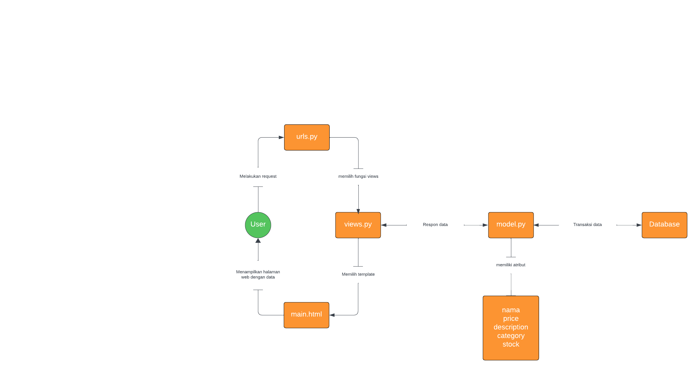
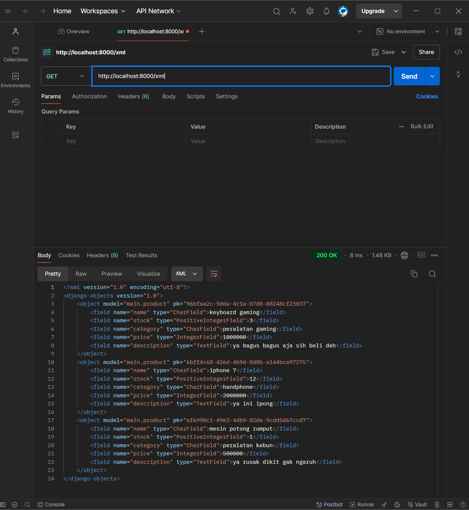
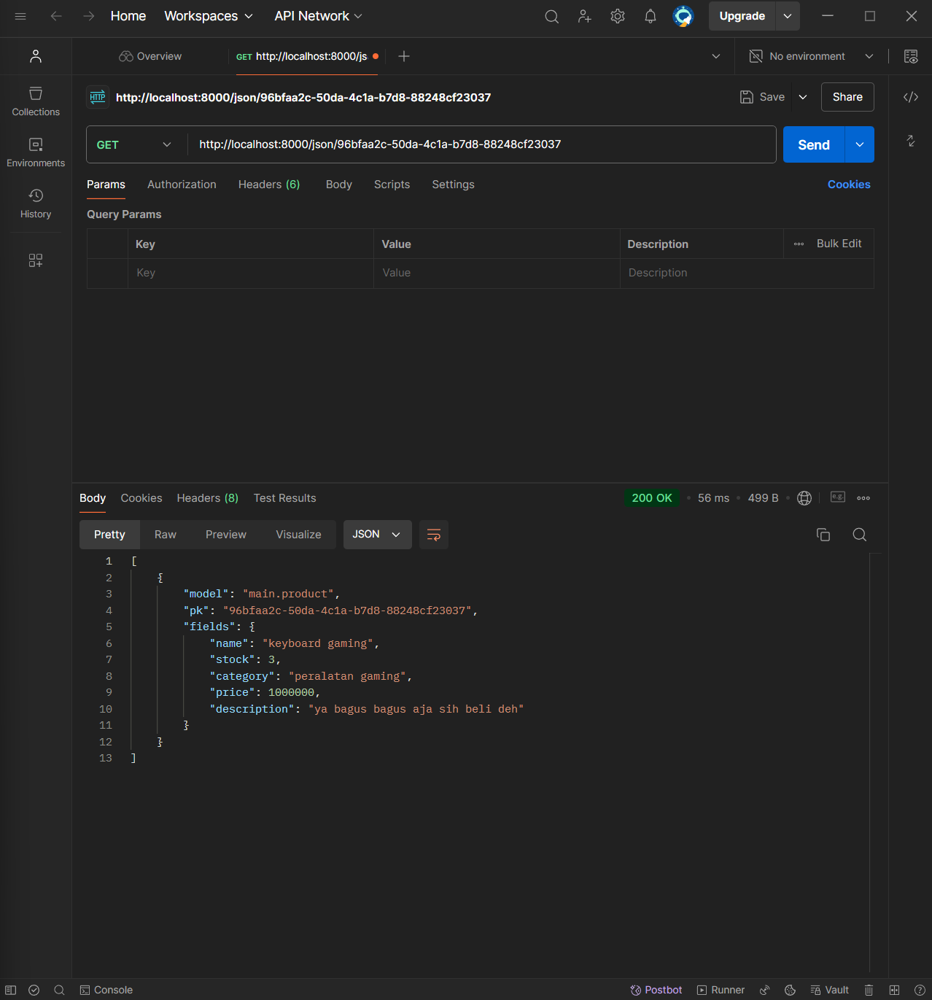
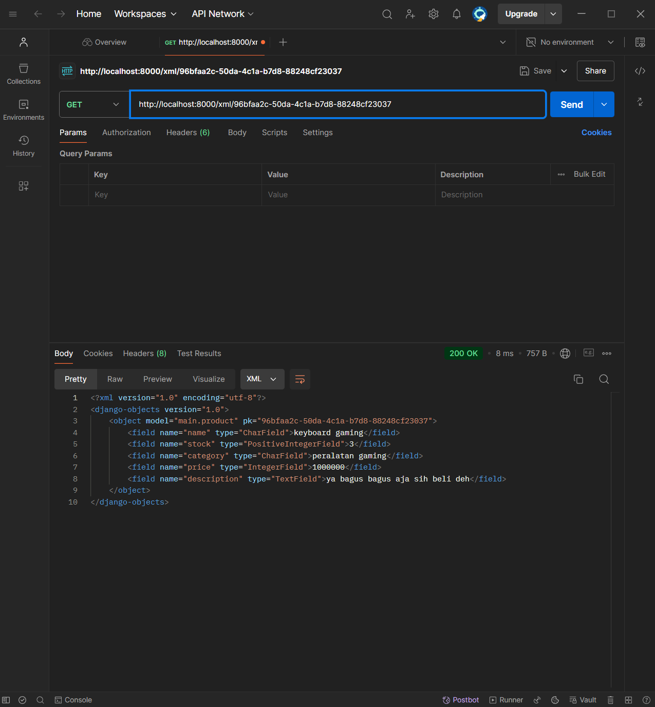

# SecondChance

SecondChance adalah platform e-commerce yang menjual barang preloved dengan fokus pada keberlanjutan dan penghematan.

## tautan ke aplikasi
[pws](http://makarim-zufar-secondchance.pbp.cs.ui.ac.id/)

[README tugas 2](#tugas-2)

[README tugas 3](#tugas-3)

## tugas 2


### membuat project django baru dan install semua requirements

saya membuat project di direktori yang saya tentukan, lalu saya menjalankan perintah untuk membuat virtual environtment

```bash
python -m venv env
```

lalu mengaktifkan virtual environtment dengan command

```bash
env/Sripts/Scripts/activate.bat
```

setelah terbentuk folder env saya akan memastikan ulang apakah requirements sudah terinstal maka saya membuat file bernama requirements.txt di file yang sama berisi

```txt
django
gunicorn
whitenoise
psycopg2-binary
requests
urllib3
```

lalu menjalankan perintah ini untuk menginstall semua yang tertulis di requirements.txt

```bash
pip install -r requirements.txt
```

lalu saya menjalankan perintah untuk membuat project

```bash
django-admin startproject SecondChance .
```

### membuat aplikasi main pada project

untuk membuat project baru saya mengetikan command berikut

```bash
python manage.py startapp main
```

### melakukan routing pada proyek agar dapat menjalankan main

setelah saya berhasil membuat aplikasi main, saya melakukan routing pada SecondChance agar bisa berjalan di `setting.py`


### membuat models

untuk model saya membuat dengan 5 varibel:
model memiliki beberapa atribut sebagai berikut:

- `name` dengan tipe `CharField`.
 Atribut itu akan menjelaskan nama dari model

- `description` dengan tipe `TextField`.
 Atribut itu akan menjelaskan deskripsi dari model

- `price` dengan tipe `IntegerrField`.
 Atribut itu akan menjelaskan harga dari model

- `stock` dengan tipe `IntegerField`.
 Atribut itu akan menjelaskan ketersediaan dari model

- `category` dengan tipe `CharField`.
 Atribut itu akan menjelaskan kelompok/kategori dari model

setelah itu saya melakukan migrate agar semua perubahan dapat diterapkan:

```python
python manage.py makemigrations
python manage.py migrate
```

### membuat fungsi `show_main` pada `views.py` untuk dikembalikan ke dalam template HTML

```pyhton
from django.shortcuts import render
from .models import Product

def show_main(request):
    context = {
        "products":[
            {
                "nama": "Makarim Zufar Prambudyo",
                "npm": "2306241751",
                "kelas": "PBP D",
            }
        ]
    }
    return render(request, 'main.html', context)  
```

pada context yang berupa dict saya membuat sebuah dict bernama product yang nantinya akan di panggil di HTML

### membuat routing pada `urls.py`

Pada langkah ini Saya membuat `urls.py` pada direktori aplikasi `main` dan gunanya untuk memetakan fungsi yang telah dibuat pada `views.py` tadi.

```pyhton
from django.urls import path
from main.views import show_main

app_name = "main"

urlpatterns = [
    path('', show_main, name="show_main"),
]
```

Di dalam fungsi `path`, Saya membuat parameter pertama sebagai `''` supaya halaman aplikasi tersebut muncul pada halaman utama localpath. Parameter kedua berisikan fungsi yang telah dibuat pada `views.py` dan parameter `name` adalah untuk pengakses fungsi tersebut.

selain itu saya juga melakukan routing pada `urls.py` yang ada pada folder proyek yaitu SecondChance agar bisa terhubung

```python
from django.contrib import admin
from django.urls import path, include

urlpatterns = [
    path("admin/", admin.site.urls),
    path("", include("main.urls")),
]
```

### persiapan upload ke pws

untuk allowed host di `setting.py` saya setting agar bisa di akses juga oleh pws

```python
ALLOWED_HOSTS = ["localhost","127.0.0.1","makarim-zufar-SecondChance.pbp.cs.ui.ac.id"]
```

### bagan yang berisi request client ke web



### fungsi git

Git dalam Pengembangan Perangkat Lunak
Git adalah sistem pengontrol versi terdistribusi yang berfungsi untuk melacak perubahan kode sumber selama pengembangan perangkat lunak. Sistem ini sangat penting untuk kolaborasi tim dan pengelolaan kode dalam proyek perangkat lunak.

Fungsi Utama Git

1.Pelacakan Perubahan (Version Control)
Git melacak setiap perubahan yang dilakukan pada kode. Setiap kali perubahan dikomit, Git menyimpan snapshot dari keadaan proyek saat itu. Ini memungkinkan pengembang untuk melihat riwayat perubahan, termasuk siapa yang mengubah apa dan kapan.

2.Kolaborasi Tim
Git memungkinkan kolaborasi antara banyak pengembang. Setiap pengembang dapat bekerja di cabang (branch) mereka sendiri tanpa mengganggu pekerjaan orang lain. Setelah perubahan siap, mereka bisa digabungkan (merge) ke cabang utama. Ini sangat membantu dalam proyek-proyek besar di mana banyak orang bekerja pada fitur yang berbeda.

3.Branching dan Merging
Fitur branching Git memungkinkan pengembang membuat jalur kerja paralel untuk berbagai fitur atau perbaikan bug. Setiap cabang bisa dikembangkan secara terpisah dan digabungkan kembali ke cabang utama setelah selesai, membantu menjaga stabilitas kode utama.

4.Revisi dan Rollback
Git memungkinkan pengembang untuk kembali ke versi kode sebelumnya jika ada masalah. Jika ditemukan bug atau masalah pada fitur baru, pengembang dapat dengan mudah membatalkan perubahan atau memperbaikinya dengan melihat riwayat perubahan.

5.Distribusi Kode
Git adalah sistem terdistribusi, yang berarti setiap pengembang memiliki salinan lengkap dari seluruh repositori di komputer mereka. Ini memungkinkan pekerjaan offline dan sinkronisasi perubahan ketika koneksi tersedia.

6.Integrasi dengan Platform CI/CD
Git terintegrasi dengan berbagai alat Continuous Integration/Continuous Deployment (CI/CD) seperti Jenkins, GitLab CI, dan GitHub Actions. Ini memungkinkan pengujian otomatis dan penerapan kode secara cepat dan berulang setiap kali ada perubahan di repositori.

7.Penyimpanan Aman
Git menyimpan semua perubahan dengan aman di repositori, memastikan bahwa data kode selalu terjaga. Ini juga mengurangi risiko kehilangan data atau kesalahan kode yang disebabkan oleh perubahan yang tidak disengaja.

8.Pengembangan Open Source
Git sangat populer di komunitas open source dan digunakan pada platform seperti GitHub, GitLab, dan Bitbucket. Pengembang di seluruh dunia dapat berkolaborasi pada proyek besar, mengirim pull request, dan melakukan review kode.

9.Integrasi dengan Manajemen Proyek
Git terintegrasi dengan alat manajemen proyek seperti Jira dan Trello, memungkinkan setiap perubahan kode terkait langsung dengan tugas atau masalah spesifik, sehingga memudahkan pelacakan kemajuan proyek.

### kenapa django di pilih sebagai media pembelajaran

Django sering dipilih sebagai framework pertama untuk dipelajari dalam pengembangan perangkat lunak, terutama untuk pengembangan web, karena beberapa alasan berikut:

1. Django Mengikuti Prinsip "Batteries-Included"
Django menyediakan banyak fitur bawaan yang memudahkan pengembang dalam membangun aplikasi web tanpa harus mencari atau mengonfigurasi banyak alat tambahan. Fitur-fitur seperti otentikasi pengguna, pengelolaan database, routing URL, dan template rendering semuanya sudah ada sejak awal. Ini membantu pemula memahami konsep-konsep dasar pengembangan web secara lebih komprehensif tanpa harus memikirkan integrasi komponen tambahan.

2. Mendukung Pembelajaran Secara Bertahap
Django mempromosikan struktur kode yang terorganisir dan mendukung pemisahan tanggung jawab antara logika aplikasi, presentasi, dan data. Ini membantu pemula memahami MVC/MVT (Model-View-Controller/Model-View-Template) dengan baik. Pengembang pemula dapat melihat bagaimana setiap bagian aplikasi bekerja sama tanpa bingung dengan arsitektur yang rumit.

3. Fokus pada Keamanan
Django memiliki banyak fitur keamanan bawaan untuk membantu pengembang menghindari kesalahan umum yang sering terjadi pada aplikasi web. Misalnya, Django melindungi dari serangan SQL Injection, Cross-Site Scripting (XSS), dan Cross-Site Request Forgery (CSRF). Dengan belajar Django, pengembang pemula juga belajar untuk mengutamakan keamanan sejak awal dalam pengembangan perangkat lunak.

4. Dokumentasi yang Luar Biasa
Dokumentasi Django sangat lengkap dan ramah pengguna, membuatnya ideal untuk pengembang pemula. Ini termasuk tutorial yang mendetail serta penjelasan yang baik untuk setiap fitur. Dokumentasi ini membantu pelajar memahami cara membangun aplikasi nyata, mulai dari hal-hal sederhana hingga yang lebih kompleks.

5. Komunitas yang Besar dan Aktif
Django memiliki komunitas yang besar dan sangat aktif. Dengan banyaknya tutorial, forum, dan dokumentasi komunitas, pemula memiliki banyak sumber daya untuk mendapatkan dukungan saat belajar. Django juga sering diperbarui oleh komunitas, memastikan bahwa framework ini tetap relevan dan sesuai dengan perkembangan teknologi terbaru.

6. Konsep DRY (Don't Repeat Yourself)
Django mengikuti prinsip DRY yang mendorong pengembang untuk menulis kode yang lebih efisien dan tidak mengulangi hal yang sama berkali-kali. Bagi pemula, ini membantu memahami pentingnya reusabilitas kode dan manajemen proyek yang lebih baik.

7. Kemudahan Integrasi dengan Teknologi Lain
Django mudah diintegrasikan dengan berbagai teknologi seperti PostgreSQL, MySQL, SQLite, Redis, dan banyak lagi. Ini memungkinkan pengembang pemula untuk mempelajari cara kerja berbagai sistem basis data dan teknologi lainnya dalam konteks pengembangan web.

8. Berbasis Python
Django dibangun menggunakan Python, salah satu bahasa pemrograman yang paling mudah dipelajari dan terstruktur dengan baik. Karena Python banyak digunakan di dunia pemrograman (termasuk dalam pengembangan perangkat lunak, data science, dan kecerdasan buatan), belajar Django membantu pemula memahami Python lebih mendalam sambil mengaplikasikannya pada proyek web.

9. Cepat untuk Membuat Prototipe
Django memudahkan pengembang untuk membuat prototipe aplikasi dengan cepat. Dalam waktu singkat, pemula bisa membangun aplikasi web dasar yang berfungsi penuh, yang memotivasi mereka untuk terus belajar dan mengembangkan proyek-proyek yang lebih kompleks.

10. Populer di Industri
Banyak perusahaan besar, termasuk Instagram, Pinterest, Mozilla, dan Disqus, menggunakan Django. Dengan belajar Django, pemula mendapatkan keterampilan yang relevan dengan dunia industri, yang bisa membuka peluang kerja atau pengembangan karir di masa depan.

### Mengapa model pada Django disebut sebagai ORM?

Model pada Django disebut sebagai ORM (Object-Relational Mapping) karena Django menggunakan pendekatan ORM untuk menghubungkan dan memetakan antara objek di dalam kode Python dengan tabel di dalam basis data relasional. ORM bertujuan untuk menghindari penulisan langsung query SQL dengan menggunakan bahasa pemrograman Python, yang lebih mudah dipahami dan digunakan oleh pengembang.

## tugas 3

### mengapa kita memerlukan data delivery dalam pengimplementasian sebuah platform?

Data delivery, atau pengiriman data, adalah proses mentransfer data dari satu titik ke titik lain dalam suatu sistem atau platform. Dalam pengembangan dan implementasi platform, data delivery memainkan peran krusial karena alasan-alasan berikut:

1.Komunikasi Efisien Antar Komponen Sistem

- Integrasi Layanan: Platform modern sering terdiri dari berbagai komponen atau layanan mikro yang harus berkomunikasi satu sama lain. Data delivery memastikan pertukaran data yang efisien antara komponen-komponen ini.

- Konsistensi Data: Pengiriman data yang tepat waktu dan akurat menjaga konsistensi informasi di seluruh sistem, menghindari inkonsistensi yang dapat menyebabkan kesalahan.

2.Pengalaman Pengguna yang Lebih Baik

- Responsivitas: Pengiriman data yang cepat meningkatkan respons sistem terhadap permintaan pengguna, memberikan pengalaman yang lebih lancar dan memuaskan.
- Personalisasi Konten: Data delivery memungkinkan platform untuk menyediakan konten yang dipersonalisasi berdasarkan data pengguna yang terkini.

3.Skalabilitas dan Kinerja Sistem

- Pengelolaan Beban Kerja: Dengan mekanisme pengiriman data yang efektif, platform dapat menangani peningkatan jumlah pengguna dan permintaan tanpa menurunkan kinerja.
- Distribusi Data: Data dapat disebarkan ke berbagai server atau lokasi geografis untuk mengoptimalkan akses dan mengurangi latensi.

4.Keamanan dan Kepatuhan

- Proteksi Data: Data delivery yang aman melibatkan enkripsi dan protokol keamanan untuk melindungi data selama transmisi.
- Kepatuhan Regulasi: Memastikan pengiriman data sesuai dengan standar dan regulasi (seperti GDPR) untuk menghindari penalti hukum.

5.Pengambilan Keputusan Berbasis Data

- Analitik Real-Time: Pengiriman data yang cepat memungkinkan analisis data secara real-time untuk pengambilan keputusan yang lebih informatif.
- Pembelajaran Mesin: Model AI dan machine learning memerlukan data yang terus diperbarui untuk meningkatkan akurasi dan kinerja.

6.Interoperabilitas dan Integrasi

- Integrasi Pihak Ketiga: Data delivery memfasilitasi integrasi dengan layanan dan API eksternal, memperluas fungsionalitas platform.
- Standar Komunikasi: Menggunakan protokol standar dalam pengiriman data memastikan kompatibilitas dan interoperabilitas antar sistem.

7.Efisiensi Operasional

- Automasi Proses: Data delivery memungkinkan automasi berbagai proses bisnis, mengurangi kebutuhan intervensi manual dan potensi kesalahan manusia.
- Pemantauan dan Pemeliharaan: Data yang dikirimkan juga digunakan untuk pemantauan sistem, membantu dalam deteksi dini masalah dan pemeliharaan proaktif.

### Menurutmu, mana yang lebih baik antara XML dan JSON? Mengapa JSON lebih populer dibandingkan XML?

menurut pendapat pribadi JSON lebih baik di banding XML dengan beberapa pertimbangan berikut:

1. Integrasi dengan JavaScript

- JSON dirancang berdasarkan sintaks objek JavaScript, membuatnya sangat mudah digunakan dalam aplikasi web modern yang banyak menggunakan JavaScript.
- Parsing dan stringifying JSON di JavaScript dapat dilakukan dengan fungsi bawaan tanpa perlu library tambahan.

2.Performansi dan Efisiensi

- JSON lebih ringan dan cepat untuk diparse dibandingkan XML, yang meningkatkan performa aplikasi terutama dalam komunikasi client-server.
- Ukuran data yang lebih kecil mengurangi waktu loading dan konsumsi bandwidth.

3.Kemudahan Penggunaan

- Sintaks JSON yang sederhana membuatnya lebih mudah dipahami dan ditulis oleh pengembang.
- JSON lebih straightforward untuk merepresentasikan struktur data umum seperti array dan objek, yang sering digunakan dalam pemrograman.

4.Adopsi yang Luas dalam API dan Layanan Web

- Banyak API modern, terutama RESTful API, menggunakan JSON sebagai format default untuk pertukaran data.
- Ekosistem pengembangan web telah bergeser ke arah stack teknologi yang lebih condong ke JSON.

5.Kompatibilitas Cross-Platform

- JSON didukung oleh hampir semua bahasa pemrograman modern, memudahkan integrasi antara berbagai sistem dan platform.
- Library dan tool untuk bekerja dengan JSON tersedia secara luas dan sering kali merupakan bagian dari pustaka standar bahasa.

6.Tren dan Evolusi Teknologi

- Dengan munculnya teknologi seperti Node.js, React, dan framework JavaScript lainnya, JSON menjadi pilihan alami untuk data interchange.
- Perkembangan layanan cloud dan microservices yang membutuhkan komunikasi cepat dan efisien juga mendorong penggunaan JSON.

### Jelaskan fungsi dari method is_valid() pada form Django dan mengapa kita membutuhkan method tersebut?

Dalam framework Django, form digunakan untuk mempermudah proses pengambilan input dari pengguna, melakukan validasi data, dan mempersiapkan data tersebut untuk diproses lebih lanjut, seperti disimpan ke dalam database. Metode `is_valid()` adalah salah satu metode penting yang digunakan dalam siklus hidup sebuah form di Django. Method `is_valid()` juga berfungsi sebagai keamanan aplikasi untuk mencegah injeksi kode dan sanitasi data.

### Mengapa kita membutuhkan csrf_token saat membuat form di Django? Apa yang dapat terjadi jika kita tidak menambahkan csrf_token pada form Django? Bagaimana hal tersebut dapat dimanfaatkan oleh penyerang?

`csrf_token` digunakan untuk mencegah Cross-Site Request Forgery (CSRF), sebuah jenis serangan keamanan di mana penyerang mencoba membuat pengguna tanpa disadari melakukan tindakan tidak diinginkan di sebuah situs web tempat mereka telah terautentikasi. CSRF adalah salah satu bentuk serangan yang sangat berbahaya karena memungkinkan penyerang mengirim permintaan berbahaya atas nama pengguna yang telah login tanpa sepengetahuan mereka.

Dalam konteks Django, `csrf_token` adalah mekanisme pertahanan yang memastikan bahwa setiap permintaan POST yang dikirim oleh form berasal dari sumber yang sah, yaitu pengguna yang berinteraksi langsung dengan aplikasi web melalui browser mereka.

yang terjadi jika tidak menambahkan `csrf_token` pada form Django:

1. Terjadi Serangan CSRF:

Tanpa csrf_token, siapa pun bisa membuat permintaan POST ke server tanpa harus melewati form asli. Penyerang bisa memanfaatkan kelemahan ini untuk memaksa pengguna melakukan tindakan di aplikasi tanpa persetujuan mereka.
Misalnya, penyerang bisa mengirimkan permintaan untuk mengubah kata sandi, melakukan transaksi, atau menghapus data penting atas nama pengguna yang sudah login.

2.Data dan Akun Pengguna Terancam:

Pengguna yang sudah login di suatu situs web bisa menjadi target serangan tanpa mereka sadari. Penyerang dapat mengirim permintaan atas nama mereka untuk melakukan tindakan berbahaya, seperti mentransfer uang, mengubah informasi akun, atau melakukan tindakan administratif lainnya.

3.Pelanggaran Keamanan yang Serius:

Tanpa perlindungan CSRF, aplikasi web menjadi lebih rentan terhadap berbagai bentuk serangan yang bisa mengekspos data pengguna, merusak integritas sistem, atau memungkinkan tindakan berbahaya dilakukan di dalam aplikasi.

bagaimana penyerang memanfaatkan kelemahan CSRF?

Cross-Site Request Forgery (CSRF) adalah jenis serangan di mana penyerang mengirimkan permintaan palsu ke server web atas nama pengguna yang telah login, tanpa sepengetahuan atau persetujuan pengguna tersebut. Berikut ini cara CSRF dapat dieksploitasi jika csrf_token tidak digunakan:

1.Menyusun Permintaan Berbahaya:

Penyerang dapat membuat situs web atau email yang berisi link atau skrip yang akan mengirim permintaan POST ke situs target.
Jika pengguna yang telah login ke situs target secara tidak sengaja mengklik link tersebut atau mengakses halaman penyerang, permintaan tersebut akan dikirimkan ke server target tanpa pengguna menyadarinya.

2.Mengambil Keuntungan dari Otentikasi Otomatis:

Jika pengguna sudah login di situs web, browser mereka akan secara otomatis mengirimkan cookie otentikasi bersama dengan permintaan POST ke server. Server mungkin akan mempercayai permintaan ini karena pengguna sudah terotentikasi.
Tanpa validasi csrf_token, server tidak memiliki cara untuk membedakan apakah permintaan tersebut benar-benar dikirim oleh pengguna yang sah melalui form yang asli atau oleh penyerang dari situs lain.

### Jelaskan bagaimana cara kamu mengimplementasikan checklist di atas secara step-by-step (bukan hanya sekadar mengikuti tutorial)

#### membuat `base.html` sebagai template untuk template lain nya

`base.html` digunakan sebagai html dasar yang akan di isikan konten dari template lain untuk menampilkan konten yang di inginkan

```html

<!DOCTYPE html>
<html lang="en">
    <head>
        <meta charset="UTF-8" />
        <meta name="viewport" content="width=device-width, initial-scale=1.0" />
        <title>base website</title>
    </head>
    <body>
        <main> </main>
    </body>
</html>
```

#### Mengedit `TEMPLATES` yang ada pads `settings.py` supaya `base.html` terdeteksi sebagai berkas template

kita harus edit `settings.py` agar `tempates` yang berisi `base.html` dapat terbaca

```bash
TEMPLATES = [
    {
        "BACKEND": "django.template.backends.django.DjangoTemplates",
        "DIRS": [BASE_DIR / "templates"],
        "APP_DIRS": True,
```

#### Mengubah `main.html` supaya meng-extend dari `base.html`

karena sudah ada `base.html` di `main.html` kita fokus untuk menampilkan konten yg berhubungan dengan `show_main`

```html
 
main 

<h1>SecondChance</h1>
<div class="keterangan">
    <p>
        SecondChance is a website for selling unused items that are still of good quality to others.
    </p>
    <p>
        SecondChance is a project by {{nama}} with npm {{npm}} class {{kelas}}
    </p>
</div>

<a class="add_product" href="">add product</a>

<table style="border:1px solid black;">
    <thead>
        <tr>
            <th>name</th>
            <th>category</th>
            <th>stock</th>
            <th>price</th>
            <th>description</th>
        </tr>
    </thead>
    <tbody>
        
        <tr>
            <td>{{ product.name }}</td>
            <td>{{ product.category }}</td>
            <td>{{ product.stock }}</td>
            <td>{{ product.price }}</td>
            <td>{{ product.description }}</td>
        </tr>
        
    </tbody>
</table>


```

#### Membuat `forms.py` untuk membuat struktur form dan meng-import form tersebut pada `views.py`

```python
from django.forms import ModelForm
from main.models import Product

class ProductEntry(ModelForm):
    class Meta:
        model = Product
        fields = ['name', 'stock', 'category', 'price', 'description']
```

#### menambahkan fungsi pada `views.py` dan memodif fungsi

memodif fungsi `show_main` agar dapat menampilkan product dari database

```python
def show_main(request):
    context = {
        "nama": "Makarim Zufar Prambudyo",
        "npm": "2306241751",
        "kelas": "PBP D",
        "products": Product.objects.all()
    }
    return render(request, 'main.html', context)  
```

membuat fungsi `add_product` agar bisa menambahkan produk

```python
def add_product(request):
    if request.method == 'POST':
        form = ProductEntry(request.POST)
        if form.is_valid():
            form.save()
            return redirect('main:show_main')
    else:
        form = ProductEntry()
    return render(request, 'add_product.html', {'form': form})
```

membuat fungsi `show_xml`, `show_xml_by_id`, `show_json`, `show_json_by_id`

```python
def show_xml(request):
    data = Product.objects.all()
    return HttpResponse(serializers.serialize('xml', data), content_type='application/xml') 

def show_json(request):
    data = Product.objects.all()
    return HttpResponse(serializers.serialize('json', data), content_type='application/json')

def show_xml_by_id(request, id):
    data = Product.objects.filter(pk=id)
    return HttpResponse(serializers.serialize('xml', data), content_type='application/xml')

def show_json_by_id(request, id):
    data = Product.objects.filter(pk=id)
    return HttpResponse(serializers.serialize('json', data), content_type='application/json')
```

#### Membuat `add_product.html`

membuat konten untuk menginput product ke database

```pyhton
 
Add product 

<h1>Add New Product</h1>

<form method="POST">

<table>
    {{ form.as_table }}
    <tr>
    <td></td>
    <td>
        <input type="submit" value="Add Product" />
    </td>
    </tr>
</table>
</form>


```

#### menambahkan path di `urls.py`

agar fungsi pada views bisa di akses kita harus membuat path yang merujuk ke fungsi itu

``` python
from django.urls import path
from main.views import show_main, show_xml, show_xml_by_id, show_json, show_json_by_id,add_product

app_name = "main"

urlpatterns = [
    path('', show_main, name="show_main"),
    path('add_product/', add_product, name="add_product"),
    path('xml/', show_xml, name="show_xml"),
    path('xml/<int:id>/', show_xml_by_id, name="show_xml_by_id"),
    path('json/', show_json, name="show_json"),
    path('json/<int:id>/', show_json_by_id, name="show_json_by_id"),
]
```

### Mengakses kelima URL tersebut menggunakan Postman

- HTML

- JSON

- XML

- JSON by ID

- XML by ID

